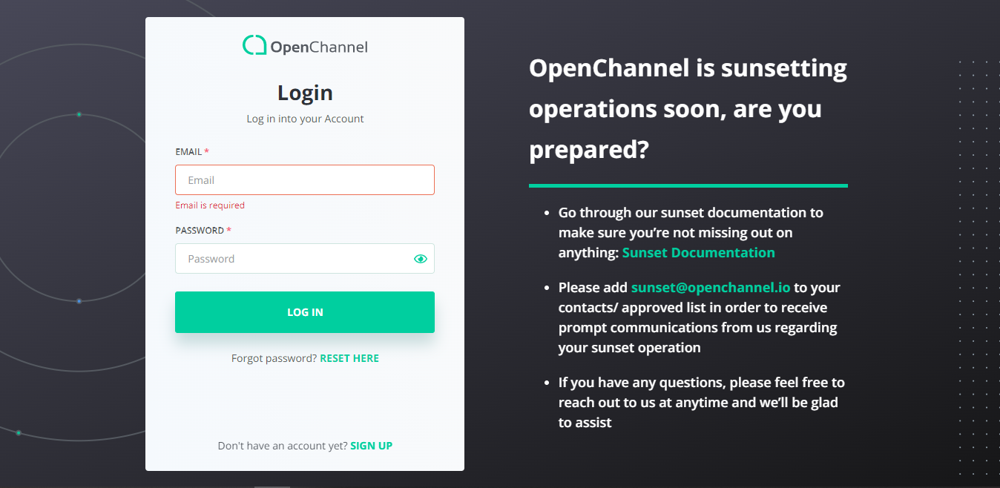

## Login


## Table of Contents

* [About the Project](#about-the-project)
  * [Built With](#built-with)
* [Getting Started](#getting-started)
  * [Installation](#installation)
* [Usage](#usage)
* [Contact](#contact)

## About The Project
Live website : * [Openchannel](https://my.openchannel.io/)
The goal of a marketplace template site is to allow users to browse and install actual applications. This app represents the market site.

Functional for User:
- Native or SSO login.
- Search approved applications. 
- Work with applications (install/uninstall, preview).
- Updating profile and organization data.
- Managing users from your organization. Invite new users.

Note: Unauthorized users can browse Applications.

### Built With
* [Bootstrap](https://getbootstrap.com) v. 4.4.1
* [Angular](https://angular.io) v. 11.2.3

## Getting Started

### Installation

- Install [node.js and npm](https://linuxize.com/post/how-to-install-node-js-on-ubuntu-18.04/):
```
sudo apt install nodejs
```
- Install the [Angular CLI](https://angular.io/cli) using the npm package manager:
```
npm install -g @angular/cli
```
- Install NPM packages
```
npm install
```

2. Optional. Dependency with @openchannel/angular-common-services.
```
npm install file:<absolute path to common service project dist/angular-common-services>
```

3. Optional. Dependency with @openchannel/angular-common-components.
```
npm install file:<absolute path to common component project dist/angular-common-components>
```


### Usage

#### Run project with the remote site configs:

- Open file:
```
/etc/hosts
```
- Add to file your custom domain. (Note: this domain can be invalid, because used only in 'Origin' headers.)
```
127.0.0.1 my-custom-domain.com
```
- Run project with the production environment:
```
sudo npm run start-with-host my-custom-domain.com
```

####  Run project with the Moesif plugin for Chrome:

- Install [Moesif](https://chrome.google.com/webstore/detail/moesif-origin-cors-change/digfbfaphojjndkpccljibejjbppifbc/related) CORS plugin for Chrome
- Submit your work email address there
- Open advanced settings
- Fill in the 'Access-Control-Allow-Credentials'<br>
  ``
  true
  ``
- Fill in the 'Response headers' field: <br>
  ``
  http://localhost:4200
  ``
- Fill in the 'Request Headers' field:<br>
  (Note: this domain can be invalid, because used only in 'Origin' headers.)
  ``
  https://my-custom-domain.com
  ``
- Then start project with command:<br>
  ``
  npm run start
  ``<br>
## Search engine discoverability

Project contains the `robots.txt` file. This file tells search engine crawlers which URLs the crawler can
access on your site. This is used mainly to avoid overloading your site with requests. Access is disallowed to the whole
site by default. If you want to allow access, change property:
```
Disallow: /
```
to
```
Allow: /
```

Documentation: [https://developers.google.com/search/docs/advanced/robots/create-robots-txt?hl=en](https://developers.google.com/search/docs/advanced/robots/create-robots-txt?hl=en)

## Documentation Compodoc
Compodoc shows project structure. (modules, components, routes etc.)

- Install NPM packages:
```
npm install
```
- Generate Documentation:
```
npm run create-compodoc
```
- Run Compodoc:
```
npm run start-compodoc
```

- Documentation [http://localhost:8804](http://localhost:8804)

## Contact

Website: [https://openchannel.io](https://openchannel.io)

## Designs

App Store Designs: [https://support.openchannel.io/guides/app-store-designs/](https://support.openchannel.io/guides/app-store-designs/)
